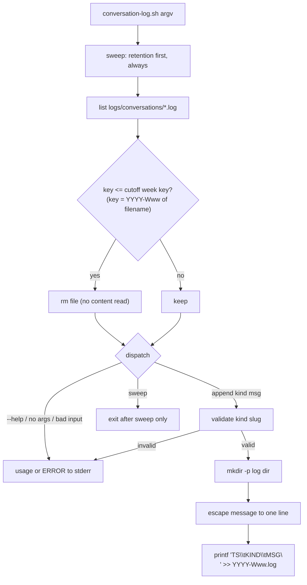
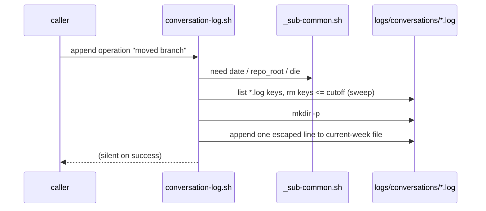

# conversation-log.sh — design

## Purpose

Append-only, weekly-rotated log of orchestrator conversations and operations,
kept for 6 months in a gitignored folder, never read during normal operation.

## Entities

| Entity | Role |
|---|---|
| `scripts/conversation-log.sh` | The script. Sources `scripts/_sub-common.sh` for `die`/`info`/`need`/`repo_root`. Commands: `append <kind> <message...>`, `sweep`, `--help`. |
| `<repo>/logs/conversations/` | Log directory, default location. Created on demand, listed in `.gitignore`. Overridable via `CONVERSATION_LOG_DIR` (tests, relocated storage). |
| `<YYYY-Www>.log` | One file per ISO week (`date -u +%G-W%V`), e.g. `2026-W39.log`. Sortable and unambiguous. |
| Log entry | Single line: `<UTC timestamp>\t<kind>\t<message>`, e.g. `2026-09-26T01:15:30Z\tconversation\tmsg`. Embedded `\`, TAB, CR, LF are escaped (`\\`, `\t`, `\r`, `\n`) so one entry is always one physical line. |
| `tests/conversation-log.test.sh` | Plain-bash end-to-end test harness (no extra framework); fakes `date` via a PATH shim to exercise rotation and retention deterministically. |
| `specs/conversation-log-script/` | Gherkin scenarios (`conversation-log.feature`) + this design doc. |
| `.gitignore`, `AGENTS.md` | Updated: ignore `logs/`, one-line helper-table entry incl. the read-on-demand rule. |

## Data flow

Retention rule: a whole file is deleted when its week key sorts at **or
before** the ISO week of `now - 6 months` (`date -u -d '6 months ago' +%G-W%V`).
Zero-padded `YYYY-Www` keys compare correctly as strings (script forces
`LC_ALL=C`). Deleting at-or-before guarantees that no entry older than 6
months can survive; as a consequence the file containing the 6-month boundary
is removed whole (at most 6 days of younger entries). Whole-file granularity
is required: the sweep must never read log content. `--help` and failed calls
also sweep — the retention check runs on *every* invocation, before argument
dispatch.

Repo resolution: `repo_root "$SCRIPT_DIR"` — the script's own checkout, so it
is safe to run from any working directory (log location does not depend on
cwd).

## Interactions

## Proposed changes

- **New** `scripts/conversation-log.sh` (executable) — the whole behaviour.
- **New** `tests/conversation-log.test.sh` (executable) — end-to-end tests,
  one test per `[REQ-n]` scenario plus supplementaries (boundary week,
  sweep on error calls, foreign cwd, operation entries).
- **New** `specs/conversation-log-script/conversation-log.feature` +
  `conversation-log-design.md`.
- **Modified** `.gitignore` — add `logs/`.
- **Modified** `AGENTS.md` — one row in the helper-scripts table documenting
  `conversation-log.sh` and the "logs are only read to resolve operational
  issues" rule.

## Best practices

- Reuses `_sub-common.sh` conventions (`die`/`ERROR:` to stderr, `need`,
  `repo_root`); additive only — no other script changes behaviour.
- No reads of log content anywhere in the script; stdout/stderr never carry
  log data; success is silent.
- Kind validated as a lowercase slug (`^[a-z0-9][a-z0-9-]*$`) so the kind
  field cannot break the line format.

## Task list

1. Specs: scenarios + this design doc. ✅
2. RED: write `tests/conversation-log.test.sh`, watch it fail (script
   missing). ✅ (37/49 assertions failed, all for missing behavior)
3. GREEN: implement `scripts/conversation-log.sh`; add `logs/` to
   `.gitignore`; go green. ✅
4. REFACTOR + verify: full suite green, `shellcheck` clean. ✅
5. Code audit (independent pass per `code-auditor`), re-run tests. ✅
6. Docs row in `AGENTS.md`, commit, push, open PR against `development`. ✅

## Strengths / weaknesses

- **Strengths**: minimal surface (one script, no deps beyond GNU date/bash),
  retention guaranteed by construction (delete at-or-before boundary week),
  testable without waiting for real week rollover (PATH-shimmed `date`).
- **Weaknesses**: whole-file retention can drop up to 6 days of entries newer
  than exactly 6 months (accepted: reading to truncate is forbidden);
  concurrent appends rely on single-`write()` line atomicity (messages are
  kept short; lines stay under `PIPE_BUF` in practice); ISO-week parsing is
  filename-string based, so hand-renamed files could be mis-swept (guarded by
  a strict `^[0-9]{4}-W[0-9]{2}\.log$` match — unmatched names are never
  touched).

## Audit note (code-auditor pass)

Independent audit against `codebase-design` found the module already deep —
small interface (`append`/`sweep`/`--help` + one env var) hiding retention,
rotation, escaping, and repo resolution; tests cross the interface by
executing the script. One improvement taken: the entry's week key is now
derived from the entry's own timestamp (`date -d "$ts" +%G-W%V`) instead of
a second independent `date` call, so timestamp and target file can never
disagree across a UTC week rollover, and the redirect target can never be an
empty string (the assignment fails loudly under `set -e`). Left as-is
(minor, documented only): `need git` is not asserted before `repo_root`
(`repo_root` still dies with a clear error if `git` is absent), and the
theoretical single-`write()` atomicity assumption for concurrent appends.
