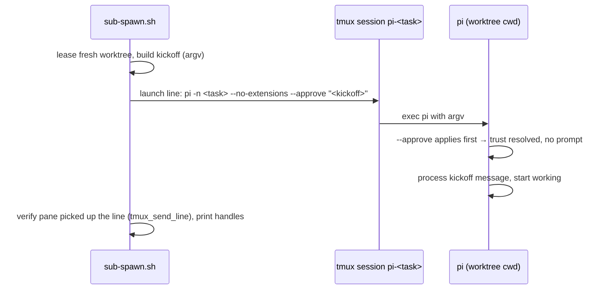

# Design: fix-worktree-trust-prompt

## Problem and root cause

`sub-spawn.sh` boots children as `pi -n <task> --no-extensions "<kickoff>"`
with the kickoff passed as pi's initial-message argument. On a **brand-new
treehouse worktree path** pi stops on the folder-trust prompt before it
processes that argument, so the child sits idle until a human presses Enter.

Pi resolves project trust in this order (docs/security.md,
"How Pi chooses a trust decision"):

1. command-line `--approve` / `--no-approve` override — applies first;
2. a user-level extension handling `project_trust` (children run
   `--no-extensions`, so never);
3. a saved decision in the agent-dir `trust.json` for the current directory
   or one of its parents (closest wins);
4. the agent-dir `defaultProjectTrust` setting (default `"ask"` → prompt).

Root cause for spawned children — two missing inputs:

- **No saved decision.** `trust.json` records canonical paths
  (`~/.pi/agent/trust.json` already lists `.../1/...` through `.../4/...`),
  and every lease mints a fresh path, so a new worktree never matches.
  Each manual Enter on the default `Trust` option *persists* another entry —
  the current workaround permanently grows the trust store.
- **No policy fallback.** [prepare_child_agent_dir](file://scripts/_sub-common.sh)
  builds the child's isolated agent dir with a minimal `settings.json`
  (`defaultProvider`/`defaultModel`/`enabledModels` + `packages: []`) and
  deliberately drops every other user-level key — including
  `defaultProjectTrust: "always"` from `~/.pi/agent/settings.json`. The
  child therefore falls through to the `"ask"` default and prompts.

The worktree does contain a protected resource (`.pi/settings.json`, the
project-local model config), so a decision is genuinely required.

## Options considered

| # | Option | Verdict |
|---|--------|---------|
| 1 | Pass `--approve` in the pi launch line ([sub-spawn.sh](file://scripts/sub-spawn.sh)) | **Chosen.** Per-process, documented for automated runs ("Use `--approve` … when an automated run needs an explicit one-time decision"), resolves before any other input, persists nothing. |
| 2 | Propagate `defaultProjectTrust` in `prepare_child_agent_dir` | Works only while the user's global policy is `"always"`; moves the fix into shared plumbing the brief did not ask to touch, and hides the decision inside a config copy. Kept as a noted observation, not changed. |
| 3 | Pre-seed `trust.json` with `~/.treehouse/` (or each worktree path after lease) | Trusts every future folder under the pool root (over-broad), or writes a permanent per-path entry (the scaling problem the brief calls out). |
| 4 | Keystroke fallback: send Enter after boot + verify | Brief's least-preferred option; reintroduces the race the verified-send helper exists to avoid, and the default `Trust` option *persists* a decision — strictly weaker than option 1. |

## Chosen design (option 1)

The launch line becomes:

```bash
printf -v PI_LAUNCH '%q -n %q --no-extensions --approve %q' "$PI_BIN" "$TASK" "$KICKOFF"
```

`--approve` is an explicit, session-scoped trust grant for exactly the
child's worktree. It persists no `trust.json` entry and changes no setting,
so it does **not** weaken pi's trust model globally — it is strictly tighter
than the status quo (manual Enter → permanent `Trust` entry), and the
kickoff stays in argv where it cannot be lost to a keystroke race.

### Trust resolution after the fix

```mermaid
flowchart TD
  A[pi starts in worktree] --> B{--approve on<br/>command line?}
  B -- yes --> C[trust granted<br/>for this process only]
  B -- no --> D{saved decision in<br/>trust.json for cwd or parent?}
  D -- yes --> E[apply saved decision]
  D -- no --> F{defaultProjectTrust?}
  F -- always --> C
  F -- ask / unset --> G[folder-trust prompt<br/>blocks the kickoff]
  G -.->|manual Enter<br/>(old behaviour, persists)| E
```

### Spawn data flow



## Files / modules

- [scripts/sub-spawn.sh](file://scripts/sub-spawn.sh) — launch-line
  construction gains `--approve` plus a comment documenting why. Only file
  changed in `scripts/`.
- `specs/fix-worktree-trust-prompt/fix-worktree-trust-prompt.feature` — the
  three atomic scenarios (source of truth).
- `specs/fix-worktree-trust-prompt/test_spawn_trust.sh` — end-to-end harness:
  sandboxes `$HOME`, runs the real `sub-spawn.sh` against a stub `treehouse`
  (mints a fresh git worktree path per lease) and a faithful stub `pi`
  (documents-and-implements the resolution order above, including the
  blocking prompt and the keystroke-persists-to-trust.json behaviour), on an
  isolated tmux socket so no live session is touched.

## Task list

- [x] Deduce atomic requirements, write scenarios + this design
- [x] Write the harness, watch `[REQ-1]`/`[REQ-3]` fail for the right reason
- [x] Live RED: real `sub-spawn.sh` + real pi on a fresh worktree → prompt
- [x] Add `--approve` to the launch line
- [x] GREEN: harness all pass, shellcheck clean, live proof on a fresh worktree
- [x] Code audit (see Audit note below)
- [x] Commit, push, open PR against `development`

## Strengths / Weaknesses

- Strength: one-token change at the exact seam (the launch line); no new
  configuration, no persisted state, no shared-helper churn.
- Strength: works regardless of the user's global `defaultProjectTrust`, the
  pool layout, or which worktree number is leased next.
- Weakness: `--approve` trusts project-local resources (settings, packages,
  extensions) for the child process — by design, equivalent to the Enter it
  replaces, and children already run `--no-extensions`.
- Weakness: if pi ever renames/retires `--approve`, spawn must follow; the
  harness's faithful stub catches that drift at test time.

## Audit note

Independent audit pass (code-auditor): re-read `.feature` + `sub-spawn.sh`
from disk, evaluated against the `codebase-design` vocabulary.

- **Overview**: the fix adds one token at the only seam where pi is launched;
  trust semantics stay an implementation detail of `sub-spawn.sh`, so the
  module's interface (args + env) is unchanged and callers/AGENTS docs learn
  nothing new — good locality, and leverage across every future spawn.
- **Deletion test**: removing `--approve` resurrects the blocking prompt at
  every fresh worktree, so the token (plus its invariant-carrying comment)
  earns its keep.
- **Testability**: the harness crosses the public seam only (run
  `sub-spawn.sh`, observe the pane) — the interface is the test surface; no
  white-box poking, no new seam introduced (one caller → extracting a
  `build_pi_launch` helper into `_sub-common.sh` would be a hypothetical
  seam, deliberately not done).
- **Less valuable improvements** (noted, not taken): (1) the inline
  KICKOFF/PI_LAUNCH construction could move to a shared helper when a second
  pi-launching caller appears; (2) the 8-line comment duplicates the design
  doc, but it is what a future editor of this exact line reads first — kept.
- **Recommendation strength**: Worth exploring (only under a second caller).
- **Verification**: full suite re-run after the audit — 4/4 PASS, shellcheck
  gate clean.
