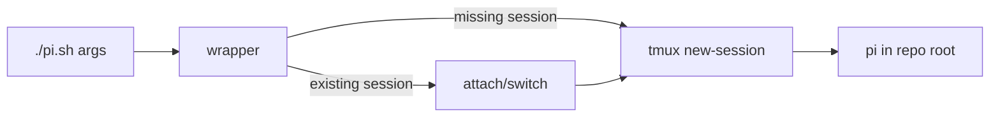

# pi.sh design

`pi.sh` is a thin process boundary around tmux. It derives the repository root
from its own location, uses the non-reserved default session name
`local-pi-ai-orchestrator`, starts `pi` once in a detached session, and then
attaches (or switches clients when `$TMUX` is set). `PI_BIN` permits an
explicit executable path for testing or installations that do not expose
`pi` on `PATH`; positional arguments are passed unchanged to `pi`.

The fixed default deliberately differs from `pi-main` and `pi-<task>`, which
remain owned by the orchestrator and child helpers. `PI_TMUX_SESSION` allows a
custom name but rejects those reserved prefixes. The wrapper does not create
an isolated agent directory: this is an interactive convenience launcher, not
a replacement for `sub-spawn.sh`.

## Test plan

Each `[REQ-n]` scenario has one shell integration test. Tests replace `tmux`
and `pi` with temporary fakes and inspect calls, so no real session is created.
Supplementary checks cover missing `pi`, quoting, and executable permissions.
