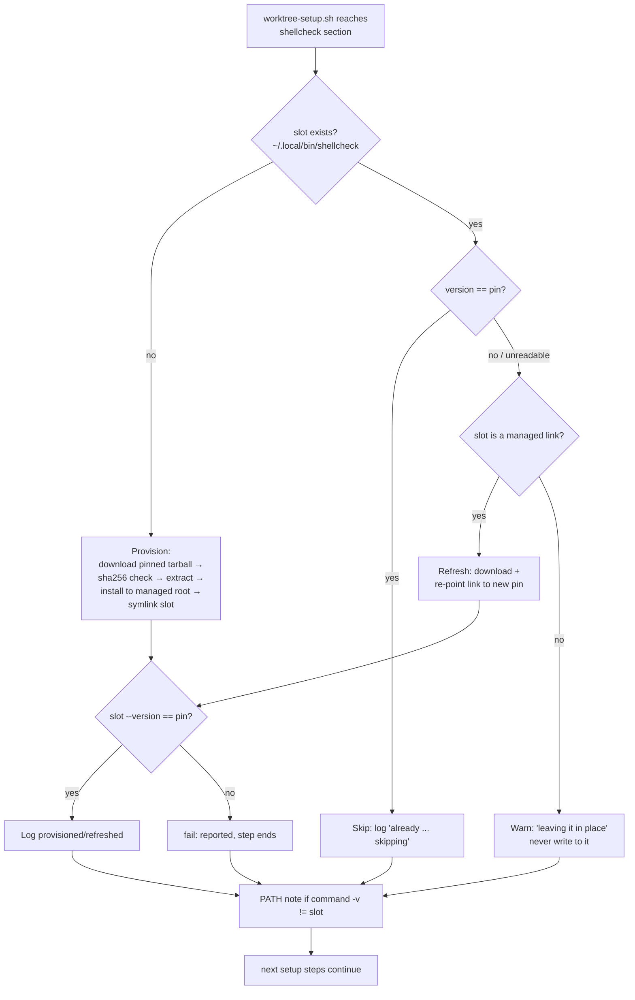

# Design: shellcheck as a declared, repo-provisioned dependency

## Summary

`scripts/worktree-setup.sh` (the treehouse `post_create` hook) gains an
unconditional, idempotent **shellcheck provisioning step**: it downloads the
official `koalaman/shellcheck` release tarball for a **pinned version**
(`SHELLCHECK_VERSION` declared at the top of the script, sha256-pinned per
platform asset), installs the binary into a managed version directory under
`$XDG_DATA_HOME`, and links it into the PATH slot `~/.local/bin/shellcheck`
— which on this machine precedes the stray `~/bin`, so
`command -v shellcheck` in any worktree resolves to the repo-provided binary
with no manual steps.

### Mechanism decision (justification)

| Option | Verdict |
|---|---|
| `apt`/`brew` install | rejected: needs `sudo` (would hang a non-interactive hook), version not pinned (apt ships 0.11.0), machine-wide and not declared by the repo |
| `mise`/`asdf`/`.tool-versions` | rejected: neither tool is installed here, so the pin file would be inert |
| project-local install inside the worktree (`tools/`, `.local/bin`) | rejected: a worktree dir is never on a "normal worktree PATH", so `command -v shellcheck` would still fail without manual steps; the binary would also vanish/dangle when `treehouse return --force` resets the worktree |
| **pinned download + link into `~/.local/bin`** | **chosen**: `~/.local/bin` is already on PATH (before the stray `~/bin`), survives worktree churn, is version-pinnable, sha256-verifiable, and is fully declared/provisioned by the repo's setup path |

`~/.local/bin/shellcheck` is a **symlink into the managed root**
`$XDG_DATA_HOME/ai-orchestrator/shellcheck/v<pin>/shellcheck`, which lets the
hook tell *its own* installs apart from a user's: managed links are refreshed
when the pin changes, anything else is never written to — only warned about
(the brief's "warn rather than reinstall over the user's").

The hook contract is unchanged: every new line goes through the existing
`log()`/`fail()` helpers (same channel as today), one failing step is
reported but never aborts the remaining steps, and a non-zero exit is
tolerated by treehouse so `get` never fails.

## Entities

- **`scripts/worktree-setup.sh`** (modified)
  - new top-of-script pins: `SHELLCHECK_VERSION=0.10.0` and
    `shellcheck_sha <asset>` (sha256 of each official release asset:
    linux/darwin × x86_64/aarch64);
  - new section `--- shellcheck (declared repo dependency) ---` placed after
    the JS block and before dart/rust/go, built from small helpers:
    `shellcheck_slot`, `shellcheck_managed_target`,
    `shellcheck_installed_version <path>`, `shellcheck_is_managed <path>`,
    `shellcheck_fetch <url> <dest>`, `shellcheck_verify_sha <expected> <file>`,
    `shellcheck_install <tmpdir>`; the decision tree is
    skip / warn / refresh / provision (see flow below);
  - after any outcome, a soft `log` note when `command -v shellcheck` does
    not resolve to the slot (PATH-order misconfiguration is visible, never
    fatal).
- **`AGENTS.md`** (modified): one bullet in the `post_create` hook list
  stating that shellcheck is a declared dependency provisioned by
  `worktree-setup.sh` (pinned, sha256-verified, idempotent, warn-not-clobber).
- **`specs/shellcheck-in-repo/`** (new): this design + `shellcheck-in-repo.feature`.
- **`tests/worktree-setup.test.sh`** (new): self-contained bash harness in
  the style of `tests/sub-retire.test.sh` — fake `HOME`/`XDG_DATA_HOME`, a
  sandbox PATH with stub `curl` / `tar` / `sha256sum` / `go` binaries, one
  test per `[REQ-n]` plus supplementary checks (checksum rejection, PATH
  note, shellcheck lint of the touched scripts).

Not touched: any other script in `scripts/`, the sibling children's
branches/sessions, the ad-hoc `~/bin/shellcheck`.

## Behaviour and data flow

Failure handling: download / checksum / extract / verify failures call
`fail()` (logs `[worktree-setup] FAILED: …`, sets `rc=1`) and the script
keeps executing the remaining sections — same contract as every other step;
treehouse tolerates the final non-zero exit so `get` is never failed.

## Steps

1. [x] Specs: `shellcheck-in-repo.feature` + this design doc.
2. [x] RED: `tests/worktree-setup.test.sh` (REQ-1…REQ-8 + supplementary),
       observed failing against the current hook.
3. [x] GREEN: implement the shellcheck section in `worktree-setup.sh`.
4. [x] REFACTOR + full suite green + `shellcheck` clean on touched scripts.
5. [x] Docs: AGENTS.md bullet (covered by REQ-8 test).
6. [x] Real verification: fresh-`HOME` run, real-`HOME` run, second run
       (idempotency), report evidence.

## Strengths / Weaknesses

- Strengths: single declared source of truth (one pin + one checksum table
  in the repo's setup path); no `sudo`; hermetic tests (no network, no real
  pool); the managed-link trick cleanly separates "ours" from "the user's".
- Weaknesses: `~/.local/bin` must be on PATH ahead of any other shellcheck
  (the hook logs a note when it is not); old managed versions are not pruned
  (accepted: a few MB, bumps are rare); the checksum table must be extended
  when adding platforms.

## Audit

Objective audit against `codebase-design`, reading only the feature file and
the modified source from disk (design doc excluded from evidence).

- **Overview**: the addition is a deep module by the script's standards —
  `shellcheck_step()` is a zero-parameter call; platform detection, pinned
  download, sha256 verification, extraction, managed install, and PATH
  visibility all sit behind it, conforming to the hook's existing
  `log`/`fail`/no-abort contract. The interface *is* the test surface: the
  suite drives the whole seam by invoking the script once per scenario.
- **Files**: `scripts/worktree-setup.sh` (new section), `tests/worktree-setup.test.sh`.
- **Problem**: none rising to architectural friction. Lesser nits:
  1. the pin + checksum table sits near the top while the slot/managed paths
     are defined at the call site — two comment blocks to read instead of one
     (kept: the top block is where a maintainer bumping the pin will look);
  2. `action=refresh` in `shellcheck_step` is logged but not otherwise
     distinguished from `install` — a small dead state distinction;
  3. `shellcheck_install` repeats `rm -rf "$tmp"` on every failure path
     instead of a `RETURN` trap — verbose, but plain-bash explicit and
     avoids global trap state.
- **Recommendation strength**: **Speculative** — nits 2–3 are cosmetic and
  are not worth the churn in a hook whose contract is "never surprise
  treehouse"; revisit only if the section grows more install paths.

Audit result: no refactor applied; suite re-run after the audit: green (11/11).
