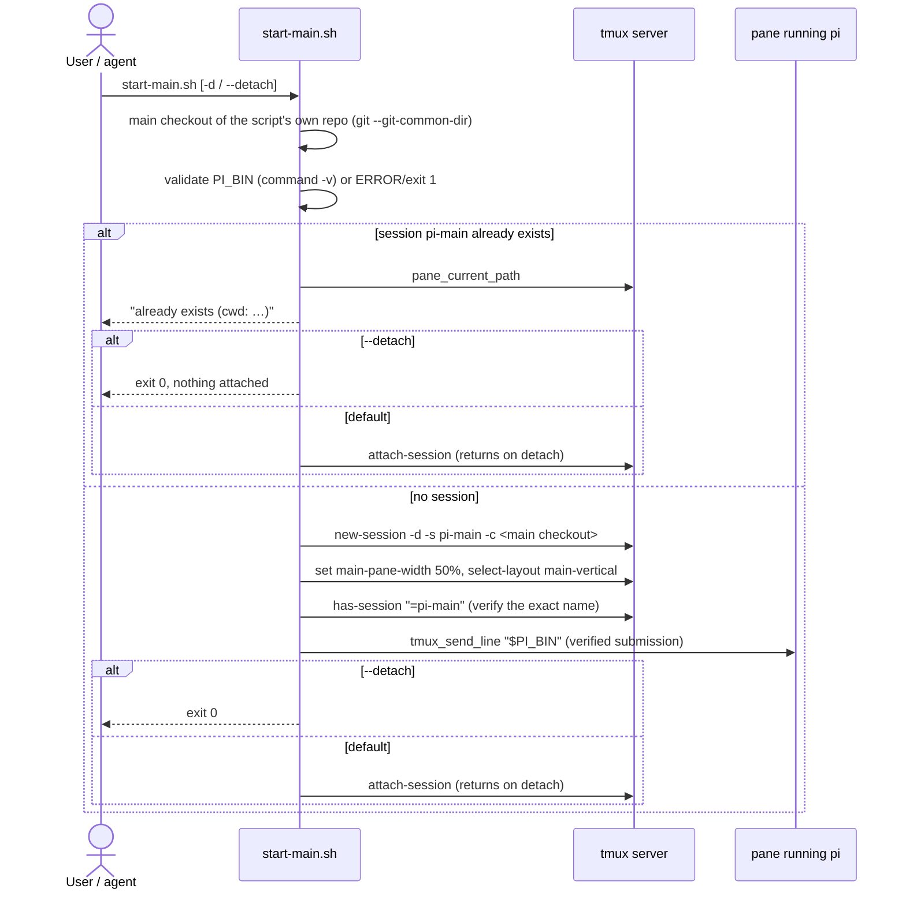
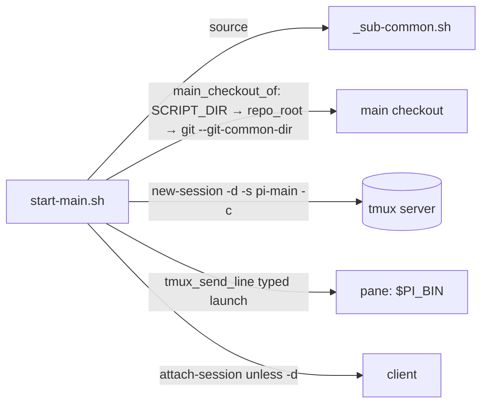

# Design: `scripts/start-main.sh`

## Purpose

One command boots the orchestrator's main pi session inside tmux session
`pi-main` (name via `MAIN_SESSION`, defaulting to `pi-main`), rooted at the
main checkout of this repository, launched and verified through the same
`tmux_send_line` convention the child scripts use. An existing session is
reported and re-attached, never restarted.

## Entities and connections

| Entity | Role |
|---|---|
| `scripts/start-main.sh` (new) | Entry point. Sources `_sub-common.sh`, resolves the main checkout, ensures-or-reports the session, launches `pi`, attaches unless `--detach`. |
| `scripts/_sub-common.sh` (unchanged) | Reused helpers: `die`/`info`/`need`, `repo_root`, `tmux_send_line`, and the `MAIN_SESSION`/`PI_BIN` defaults. |
| `AGENTS.md` (one table row) | Documents the new helper in the *Helper scripts* table. |
| `specs/start-main-script/` (new) | Gherkin scenarios ([REQ-n]) + this design doc. |
| `tests/test-start-main.sh` (new) | Self-contained bash test harness, one test per scenario. |

## Data flow / module layout

- **Flag parsing**: only `-d` / `--detach` are accepted; anything else hits
  `usage()` → `die` (`ERROR:` on stderr, exit 1) before any tmux contact.
- **Repo resolution**: `main_checkout_of "$SCRIPT_DIR"` — the script's own
  repository, then mapped from the shared `.git` directory to the *main*
  worktree, so running the copy inside a linked worktree still roots the
  session at the main checkout. Falls back to the script's repo root when the
  mapping is not possible (e.g. bare repo). Invocation cwd is irrelevant.
- **Session naming**: `SESS=$MAIN_SESSION` (default `pi-main` from
  `_sub-common.sh`) keeps the name consistent with what `sub-report.sh`
  targets; after creation the name is re-checked with the exact-match target
  `"=$SESS"` so a tmux hook/rename cannot silently change it.
- **Launch**: `tmux new-session -d` starts the default shell at the checkout,
  then `tmux_send_line "$SESS" "%q'd $PI_BIN"` types the launch and confirms
  submission (re-types / retries Enter) — no stranded-prompt race. Plain
  `$PI_BIN`, no `-n`/`--no-extensions`: the main session is not a child.
- **Layout**: on the *creation* path only, the window gets
  `main-pane-width 50%` and the `main-vertical` layout (best-effort, same
  style as `open_viewer_window`), so children spawned later arrange on the
  right half. An existing session's window is never touched.
- **Attach**: default attaches (`attach-session -t "=$SESS"`); control returns
  to the caller after the user detaches. `-d`/`--detach` exits 0 after
  starting or reporting. Existing session + default: message states it is
  attached *without restarting*.

## Proposed changes

1. `scripts/start-main.sh` — new script (~70 lines).
2. `AGENTS.md` — one row in the *Helper scripts* table.
3. `specs/start-main-script/*.feature`, `*-design.md` — this folder.
4. `tests/test-start-main.sh` — harness; runs the script against an
   **isolated tmux server** (`TMUX_TMPDIR` sandbox, `TMUX`/`MAIN_SESSION`/
   `PI_BIN` unset) so it can never touch a live `pi-main`. `PI_BIN` fakes are
   small shell scripts that echo and sleep; the attach scenario drives a pty
   with `script(1)` and detaches the client server-side.

## Task list

- [x] Deduce requirements, write Gherkin `[REQ-1..9]` + design doc.
- [x] RED: write `tests/test-start-main.sh`, watch every scenario fail for
      the right reason (missing script/behaviour).
- [x] GREEN: implement `scripts/start-main.sh`.
- [x] REFACTOR + verify: all scenarios green, `shellcheck` clean
      (`shellcheck -x -P SCRIPTDIR scripts/start-main.sh tests/test-start-main.sh`).
- [x] Code audit (`code-auditor`): no major improvements found; the small
      ones are recorded under *Audit note* below (one applied).

## Strengths / Weaknesses

- **Strengths**: reuses `_sub-common.sh` verbatim (same conventions as the
  child scripts); zero send-keys races (`tmux_send_line`); tests are hermetic
  (own tmux server, marker fakes) and portable (bash + tmux + procps only).
- **Weaknesses**: `main_checkout_of` relies on `--path-format=absolute`
  (git ≥ 2.31) with a safe fallback; the attach behaviour can only be
  exercised through a pty (`script(1)`), which adds one platform dependency
  to the test suite; layout application is best-effort by convention and its
  failure would only surface in the test, not at runtime.

## Audit note (code-auditor, step 2 — no major improvements)

Objective findings against `codebase-design`, kept as-is unless noted:

1. **`main_checkout_of` is script-local.** With one caller that is correct
   (a seam needs two call sites to be real); extract it to
   `_sub-common.sh` beside `repo_root` the moment a second script needs
   "the main checkout" (e.g. `sub-spawn.sh`, `sub-clean.sh`).
   *Recommendation: Worth exploring (later).*
2. **Target-style inconsistency (applied).** The two layout calls used the
   bare `$SESS` window target while every other lookup uses the exact
   `=$SESS` / `=$SESS:` form; failure risk was negligible (the session was
   just created under that exact name) but the uniform form is cheaper to
   maintain. Now `"$SESS:"` — covered by the `[REQ-5]` test.
3. **`sleep 0.5` before the launch** duplicates a timing heuristic from
   `sub-spawn.sh`; `tmux_send_line`'s re-type loop could carry the wait on
   its own. Kept for parity with `sub-spawn.sh` (robustness over 0.5 s).
4. **`finish()` mixes control flow (`exit`) with the attach side effect** —
   idiomatic and readable at this size; splitting it would add interface
   for no leverage.
*Recommendation strength for the set: Worth exploring (1), Speculative (3–4).*
