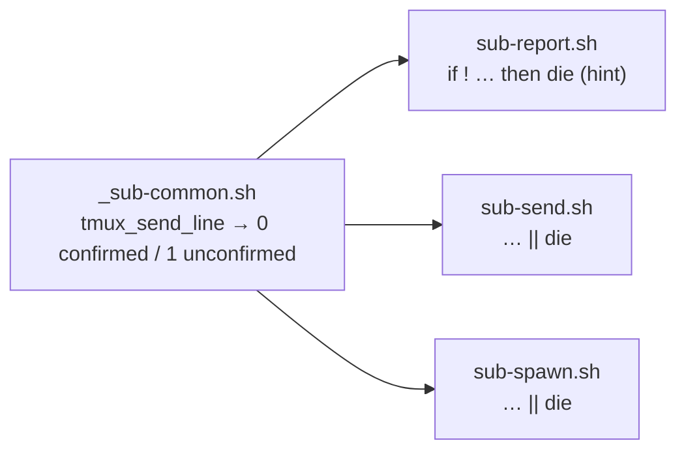

# Design: reliable child-to-main push notices (sub-report.sh)

## Summary

`scripts/sub-report.sh` hand-rolls `send-keys -l` + a fixed `sleep 0.3` +
`Enter` and then unconditionally prints `notice sent`. It never verifies that
the notice landed, so a dropped Enter (the TUI mid-redraw race documented in
AGENTS.md) strands the text in the composer while the script exits 0 — the
exact silent failure the push notice exists to prevent. The missing-session
and no-tmux paths only warn (exit 0) or print a bare error without pointing
the caller back at the durable report file.

The fix routes delivery through the shared verified-send helper
`tmux_send_line` (already used by `sub-send.sh` / `sub-spawn.sh`), gives that
helper a real **return-status contract** (0 = confirmed submitted, 1 = could
not confirm), and turns every impossible/unconfirmed delivery into a loud
failure: `ERROR:` on stderr, non-zero exit, and a hint at
`tmp/pi-sub/reports/<task>.md`, which remains the source of truth.

## Entities

- **`scripts/_sub-common.sh`** (modified)
  - `tmux_send_line <target> <text> [attempts] [settle]` gains a return
    status: `0` only when the pane content changed after an Enter (line
    confirmed submitted), `1` when it could not be confirmed (text never
    appeared after re-typing, or the pane stayed frozen after all Enter
    retries, or `send-keys` itself failed).
  - Behaviour (re-type loop, Enter-retry loop, flattened probe) is unchanged;
    only the final `return 0` becomes the honest status. Docstring updated.
- **`scripts/sub-report.sh`** (modified)
  - argument parsing first, then an explicit `command -v tmux` guard that
    fails with `ERROR: … hint` (replaces the hint-less `need tmux`);
  - missing `MAIN_SESSION` → `die` (ERROR + non-zero + report-file hint)
    instead of `warn` + `exit 0`;
  - delivery via `tmux_send_line "$TARGET" "$MSG"` inside an `if !` guard:
    non-zero → `die` with the same hint; success → `notice delivered to …`.
  - The `MAIN_PANE`-resolution block (stable pane ID when it belongs to the
    selected session, warn + fall back otherwise) is kept as-is.
- **`scripts/sub-send.sh`** (modified, call site only):
  `tmux_send_line … || die "could not confirm …"` — a non-confirmed
  instruction must not print `instruction sent`.
- **`scripts/sub-spawn.sh`** (modified, call site only): an unconfirmed
  kickoff `die`s instead of leaving an idle child behind while reporting
  handles (the EXIT trap then releases the worktree/session as for any other
  spawn failure).
- **`AGENTS.md`** (modified): step 4 gains 3 lines documenting the verified
  send and the loud-failure contract.
- **`specs/sub-report-notice/`** (new): this design + the feature file.
- **`tests/sub-report.test.sh`** (new): behavioural suite with a stateful
  fake `tmux` on `PATH` (modes: `ok`, `drop-text`, `drop-enter`) — no real
  tmux session, and specifically **never the live `pi-main`**, is touched.

## Behaviour and data flow

```mermaid
flowchart TD
    A["sub-report.sh &lt;task&gt; &lt;msg&gt;"] --> B[parse + valid_task<br/>MSG='[task] msg']
    B --> C{tmux on PATH?}
    C -- no --> X1["die: missing tmux<br/>hint: reports/&lt;task&gt;.md REQ-3"]
    C -- yes --> D{"has-session =MAIN_SESSION?"}
    D -- no --> X2["die: session not running<br/>hint: reports/&lt;task&gt;.md REQ-2"]
    D -- yes --> E[resolve TARGET<br/>MAIN_PANE if it belongs<br/>to MAIN_SESSION]
    E --> F["tmux_send_line TARGET MSG<br/>(shared verified send)"]
    F --> G[re-type while text<br/>never appears REQ-4]
    G --> H[Enter + settle, repeat<br/>while pane frozen REQ-5]
    H --> I{pane changed<br/>after Enter?}
    I -- yes --> J["exit 0: notice delivered REQ-1"]
    I -- no --> X3["die: not delivered<br/>hint: reports/&lt;task&gt;.md REQ-6"]
```

Call sites of the shared helper:



Key decisions:

1. **Reuse, don't re-implement** — the retry logic (re-type when the text
   never appears, re-Enter while the pane stays frozen, flattened probe
   tolerant of wrapping) already exists for the spawn/send path; sub-report
   now goes through the same choke point, so all three callers share one
   notion of "confirmed submitted".
2. **Return status, not side effects** — `tmux_send_line` keeps its
   signature and heuristics; the only change is that the final `return 0`
   reports the truth. Each call site decides what unconfirmed means: the
   report/send/spawn paths treat it as fatal (`die`), because a silently
   dropped line is worse than a loud failure in every one of them.
3. **Loud failure with a redirect, not a new mechanism** — every failure
   path prints `ERROR:` + non-zero + the `tmp/pi-sub/reports/<task>.md`
   hint. The helper never suggests another notification channel; the report
   file stays the source of truth (AGENTS.md step 4).
4. **Exit order** — arguments (and therefore the report hint) are validated
   before the tmux check so the no-tmux error can name the report file.
5. **Verification heuristic is inherited unchanged** — "pane content changed
   after Enter" (whitespace-tolerant) is the same evidence the spawn path
   already relies on; changing it would risk the false-negative/false-positive
   trade-off shared by all callers.

## Files / modules changed

| File | Change |
|---|---|
| `scripts/_sub-common.sh` | `tmux_send_line` returns 0/1 (confirmed / unconfirmed) + docstring |
| `scripts/sub-report.sh` | verified send via `tmux_send_line`; loud failures (no tmux, missing session, unconfirmed) with report-file hint |
| `scripts/sub-send.sh` | call site: `‖ die` with clear message on unconfirmed send |
| `scripts/sub-spawn.sh` | call site: `‖ die` on unconfirmed kickoff (spawn fails loudly instead of idling) |
| `AGENTS.md` | step 4: verified delivery + loud failure + report-file hint |
| `specs/sub-report-notice/*.feature` | new — requirements |
| `specs/sub-report-notice/sub-report-notice-design.md` | new — this doc |
| `tests/sub-report.test.sh` | new — behavioural tests (fake tmux, mode-driven) + shellcheck check |

## Test plan (1 test per scenario)

| REQ | Test |
|---|---|
| REQ-1 | happy path: exact `[task] <msg>` (brackets/quotes/unicode) reaches the pane, exit 0, delivery reported |
| REQ-2 | missing session: ERROR + report hint + non-zero |
| REQ-3 | no tmux on PATH: ERROR + report hint + non-zero |
| REQ-4 | `drop-text` mode: text sent ≥ 2 times (re-type) |
| REQ-5 | `drop-enter` mode: Enter sent ≥ 2 times (retry) |
| REQ-6 | `drop-enter` mode: ERROR + hint + non-zero + no success line |
| REQ-7 | `sub-send.sh` happy path unchanged: instruction lands, exit 0 |
| REQ-8 | AGENTS.md step 4 mentions verified delivery / loud failure / report file |
| REQ-9 | `shellcheck` on all touched scripts (skip when absent) |
| supp. | `sub-send.sh` with a frozen pane exits non-zero, never prints `instruction sent` |

## Strengths / Weaknesses

- **Strengths**: one shared definition of "delivered" for all three callers;
  failures always redirect to the durable report file instead of inviting an
  external notification mechanism; tests simulate every failure mode through
  a stateful fake tmux without touching a live orchestrator session.
- **Weaknesses**: confirmation is heuristic (pane content must change after
  Enter) — a pane that changes spontaneously could mask a stranded line, and
  a pane narrower than the 60-char probe could re-type needlessly (both are
  inherited trade-offs of the shared helper, not new ones); the frozen-pane
  tests cost ~5 s each because they exercise the real retry timing.

## Code audit note (independent review, post-implementation)

Audited `scripts/sub-report.sh`, `scripts/sub-send.sh`, `scripts/sub-spawn.sh`
and `tmux_send_line` in `scripts/_sub-common.sh` against
`sub-report-notice.feature` (sources from disk, tests and this doc excluded)
using the `codebase-design` vocabulary — no major improvements detected, so no
refactor beyond the first item below. The less valuable improvements,
recorded for later:

1. **Applied during the audit**: the failure hint now derives from
   `$SCRATCH_DIR` instead of hard-coding `tmp/pi-sub/...`, so an overridden
   scratch location is reported correctly (the suite pins `SCRATCH_DIR`).
2. `sub-report.sh`'s explicit `command -v tmux` duplicates `need`'s check —
   kept, because `need` dies without the report-file hint and widening its
   interface for a single caller would be a hypothetical seam.
3. `undeliverable()` and the `MAIN_PANE` target-resolution block belong in
   `_sub-common.sh` only once a second caller appears (one call site each
   today).
4. `tmux_send_line` mixes stderr warnings with its status return; a caller
   that ignored the status would still see the diagnosis — deliberate, since
   every current caller reads the status and turns it into a loud failure.

Strengths confirmed by the audit: `tmux_send_line` is a deep module (one
small interface hiding the re-type/Enter-retry/probe logic, now returning a
result instead of only a side effect); the call sites apply a one-line
fatality policy; tests cross the CLI seam with a single adapter (the fake
`tmux`) at the pre-existing PATH seam.
